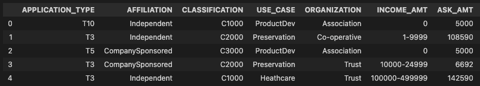

# Overview of the analysis

This analysis uses machine learning and neural networks to create a binary classifier that is capable of predicting whether applicants will be successful if awarded funding.

The analyses using a csv file containing more than 34,000 organizations that have received funding over the years. Within this dataset are a number of columns that capture metadata about each organization, such as the following:

- EIN and NAME—Identification columns
- APPLICATION_TYPE—Alphabet Soup application type
- AFFILIATION—Affiliated sector of industry
- CLASSIFICATION—Government organization classification
- USE_CASE—Use case for funding
- ORGANIZATION—Organization type
- STATUS—Active status
- INCOME_AMT—Income classification
- SPECIAL_CONSIDERATIONS—Special consideration for application
- ASK_AMT—Funding amount requested
- IS_SUCCESSFUL—Was the money used effectively

# Results

### Data Preprocessing

The data was preprocessed using Pandas and the Scikit-Learn’s StandardScaler().

What variable(s) are considered the target(s) for your model?
IS_SUCCESS is the only taget variable. The variable is binary and indicates whether the organization applying for funding used the money effectively.

What variable(s) are considered to be the features for your model?
Below columns are considered features for the model.

What variable(s) are neither targets nor features, and should be removed from the input data?
The following columns were dropped:

- EIN and NAME—Identification columns
- STATUS—Active status
- SPECIAL_CONSIDERATIONS—Special consideration for application

### Compiling, Training, and Evaluating

A deep learning model was created using TensorFlow.

How many neurons, layers, and activation functions did you select for your neural network model, and why?

- The final model has 3 layers with 100, 80, and 50 neurons respectively.
- The tanh activation function was used for the hidden layers.
- The Sigmoid activation function was used for the output layer, as the output of the model is binary.

Were you able to achieve the target model performance? The final model reached ~71% accuracy.

What steps did you take to try and increase model performance?

- Removed STATUS, and SPECIAL_CONSIDERATIONS columns as these were not adding value to the model.
- Applied bucketing to the ASK_AMT, re-organizing amounts by intervals.
- Increased the number of neurons in the hidden layers
- Added a third hiden layer
- Updated the hidden layer activation function

## Summary

The deep learning model only reached ~71% accuracy after optimization. It would be interesting to create another model using Random Forest classifiers, and compare results. Random forest classifiers are a type of ensemble learning model that combines multiple smaller models into a more robust and accurate model. Random forest models use a number of weak learner algorithms (decision trees) and combine their output to make a final classification (or regression) decision. Structurally speaking, random forest models are very similar to their neural network counterparts. Both output and feature selection of random forest models are easy to interpret, and they can easily handle outliers and nonlinear data.
